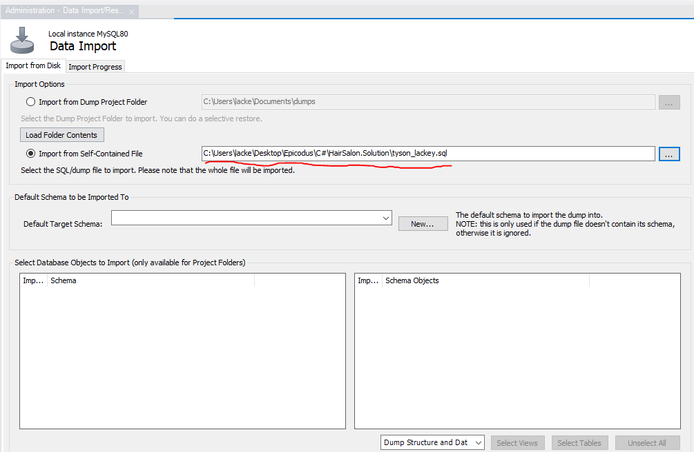
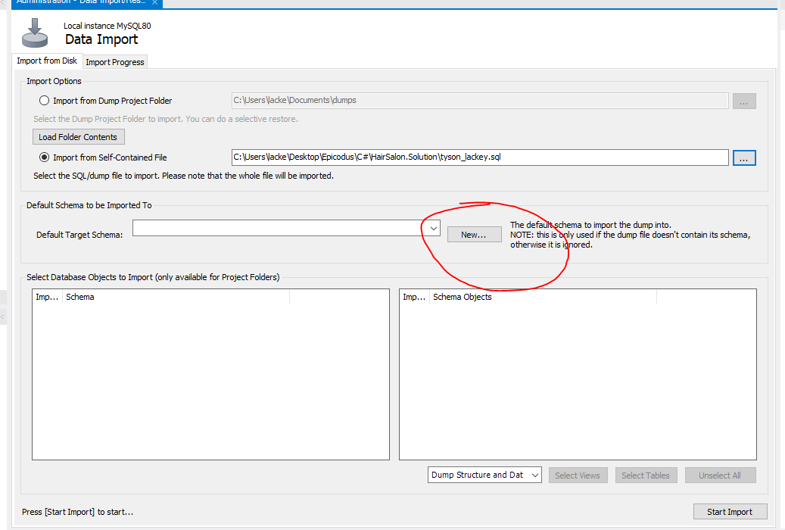

<h1 align="center"><strong>Eau Claire's Salon</strong></h1>

<h4 align="center"><em>A Hair Salon employee portal and associated SQL database that stores Stylist and Client information</em></h4>


##### __Created:__ 7/31/2020
##### __Last Updated:__ 7/31/2020 
##### By _**Tyson Lackey**_  


## Description

A SQL database stores Stylist details and their many Client records. The program can allow a user to create, edit, delete, and view Sylist records and their associated Clients, as well as Clients and their parent Stylist.

## Behaviors

| Spec| Example input | Example Output
| ----------- | ----------- | ----------- |
|The program takes a user input of Client Name, Phone Number, and Hair Style and save it to the clients database table | "Name: Tyson, Phone Number: 5555555555, Hair Style: Buzz Cut"| n/a |
|The program user to edit Client Name, Phone Number, and Hair Style and update the associated record in the clients database table | "Name: Tyson Lackey, Phone Number: 5555555554, Hair Style: high and tight"| n/a |
|The program user to delete a client record Client Name, Phone Number, and Hair Style from the clients database table | n/a | n/a |
|The program takes a user input of Stylist Name and About and save it to the stylists database table | "Name: Steve, About: 5+ years of experience, mainly cut men's hair" | n/a |
|The program user to edit Stylist Name and About and update the associated record in the stylists database table | "Name: Tyson Lackey, About: 6+ years of experience, mainly cut men's hair"| n/a |
|The program user to delete a Stylist record Stylist Name and About from the stylists database table | n/a | n/a |
|The program displays all associated clients for a stylist | n/a | n/a |
|The program displays the associated stylist for a client | n/a | n/a |


## Setup/Installation Requirements

##### &nbsp;&nbsp;&nbsp;&nbsp;&nbsp;&nbsp;Open via Bash/GitBash:

1. Clone this repository onto your computer:
    "git clone https://github.com/Lackeyt/HairSalon.Solution"
2. Navigate into the "HairSalon.Solution" directory in Visual Studio Code or preferred text editor:
3. Open the project by typing "code ." while in the previous directory in your terminal.
4. Open your computer's terminal and navigate to the directory bearing the name of the program and containing the top level subdirectories and files.
5. Enter the command "dotnet build" in the terminal and press "Enter".
6. Enter the command "dotnet watch run" in the terminal and press "Enter".

##### &nbsp;&nbsp;&nbsp;&nbsp;&nbsp;&nbsp; Configue MySQL Workbench Database:
1. Launch MySQL Workbench
2. Select "Create a new SQL tab for executing queries"

3. Enter the following SQL into the query window and click "execute"

```
DROP DATABASE IF EXISTS tyson_lackey;
CREATE DATABASE tyson_lackey;
USE tyson_lackey;

CREATE TABLE `clients` (
  `ClientId` int NOT NULL AUTO_INCREMENT,
  `StylistId` int NOT NULL DEFAULT '0',
  `Name` varchar(45) NOT NULL DEFAULT 'Anonymous',
  `PhoneNumber` int DEFAULT NULL,
  `HairStyle` text,
  PRIMARY KEY (`ClientId`)
);

CREATE TABLE `stylists` (
  `StylistId` int NOT NULL AUTO_INCREMENT,
  `Name` varchar(45) NOT NULL DEFAULT '-Redacted-',
  `About` text,
  `HireDate` date NOT NULL DEFAULT (curdate()),
  PRIMARY KEY (`StylistId`)
);
```

##### &nbsp;&nbsp;&nbsp;&nbsp;&nbsp;&nbsp; Configue MySQL Workbench Database using database import:
1. In the Administration window of SQL Workbench, select 'Data Import/Restore'

2. Select 'Import from self-contained file" from the data import window.

3. Navigate to the file path titled tyson_lackey.sql in the Solution file.

4. Under 'Default Schema to be Imported To', click the "new" button.

5. Name the schema 'tyson_lackey' and click "ok"

6. Click 'Start Import'


## Known Bugs

* Front end error handling for null values submitted with forms not in place. (currently just assigned default values in the database)

## Support and contact details

* Discord: TysonL#4409
* Email: lackeyt90@gmail.com

## Technologies Used

* Visual Studio Code
* HTML
* CSS
* Bootstrap
* C#
* MVC
* MySQL Workbench
* Entity Framework
* .NET Core

### License

Copyright (c) 2020 **_Tyson Lackey_**

This software is licensed under the MIT license.