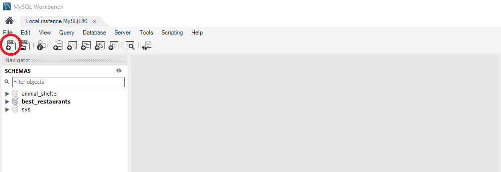

#  _Eau Claire's Salon_

#### _A Hair Salon employee portal and associated SQL database that stores Stylist and Client information_
##### __Created:__ 7/31/2020
##### __Last Updated:__ 7/31/2020 
##### By _**Tyson Lackey**_  


## Description

_A SQL database stores Stylist details and their many Client records. The program can allow a user to create, edit, delete, and view Sylist records and their associated Clients, as well as Clients and their parent Stylist. _

## Behaviors

| Spec| Example input | Example Output
| ----------- | ----------- | ----------- |
||||


## Setup/Installation Requirements

##### &nbsp;&nbsp;&nbsp;&nbsp;&nbsp;&nbsp; Configue MySQL Workbench Database:
1. Launch MySQL Workbench
2. Select "Create a new SQL tab for executing queries"

3. Enter the following SQL into the query window and click "execute"

```

```

##### &nbsp;&nbsp;&nbsp;&nbsp;&nbsp;&nbsp;Open via Bash/GitBash:

1. Clone this repository onto your computer:
    "git clone https://github.com/Lackeyt/HairSalon.Solution"
2. Navigate into the "HairSalon.Solution" directory in Visual Studio Code or preferred text editor:
3. Open the project
    "code ."
4. Open your computer's terminal and navigate to the directory bearing the name of the program and containing the top level subdirectories and files.
5. Enter the command "dotnet build" in the terminal and press "Enter".
6. Enter the command "dotnet watch run" in the terminal and press "Enter".

## Known Bugs

* 

## Feature Roadmap

## Support and contact details

* Discord: TysonL#4409
* Email: lackeyt90@gmail.com


## Technologies Used

* Visual Studio Code
* HTML
* CSS
* Bootstrap
* C#
* MVC
* MySQL Workbench
* Entity Framework
* .NET Core

## Resources:

* 

### License

Copyright (c) 2020 **_Tyson Lackey_**

This software is licensed under the MIT license.